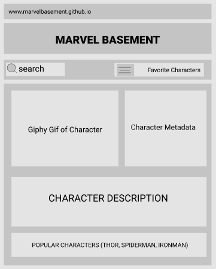
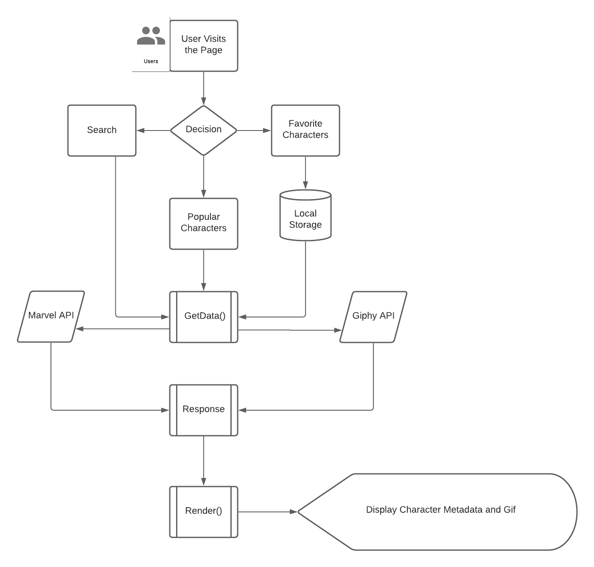

# MARVEL BASEMENT

## Project Proposal

https://docs.google.com/document/d/1xlb2Wbuf3VzThBBH9GYIb5AnOdUdi-0cRYnHxcURySU/edit#

 

### Overview
A website to search for characters from the Marvel universe that will display useful metadata and descriptions along with animated gifs.
User Story
As a comic nerd.
I want the rundown of my favorite characters accompanied by a cool gif.
So I can learn more about the marvel universe in a pleasing UI.

 

### Wireframe

https://www.figma.com/file/1WpxH28WEbw8vw58RD60vJ/Marvel-Basement-Wireframe?node-id=0%3A1 

  

### Userflow

https://lucid.app/lucidchart/112cf8cd-16e6-41f6-a40f-9c3f34b0d98c/edit?page=0_0#

 

### Specifications
1. APIs
Marvel API: https://developer.marvel.com/docs 
Giphy API: https://developers.giphy.com/ 

2. CSS Frameworks
Semantic UI: https://semantic-ui.com/behaviors/api.html
Google Fonts: https://fonts.google.com/specimen/Bangers#standard-styles  

3. Jquery: https://jquery.com/ 

4. Font Awesome: https://fontawesome.com/start 

 

### Project Kanban
https://github.com/orgs/API-Guild/projects/1?add_cards_query=is%3Aopen

### Milestones
1. **Setup Project**
Create a repository with branch rules and permissions. Collect all necessary links for the specs defined for the project.

2. **UI Layout**
Define and hardcode the html with baseline CSS framework.

3. **API Integration**
Obtain API keys, write AJAX calls and make the app dynamic.

4. **Local Storage**
Save favorite characters to local storage.

5. **Styling**
Brand the app for comic book look and feel.

6. **QA/QC**
Identify and remove bugs.

