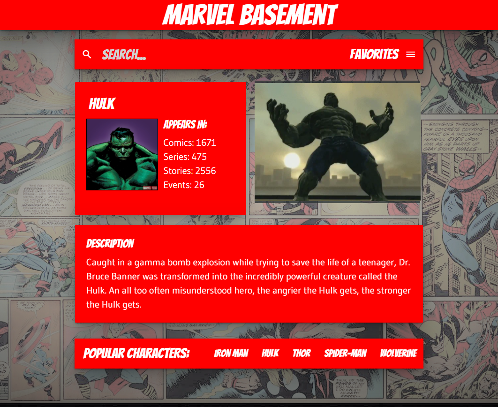

# MARVEL BASEMENT


<br>

## Overview
A website that searches for characters from the Marvel universe, displaying useful metadata and descriptions along with animated gifs.

<br>

:bust_in_silhouette: **User Story:**
```
As a comic nerd.
I want the rundown of my favorite characters accompanied by a relevant gif.
So I may learn more about the marvel universe in a pleasing UI.
```

<hr>
<br>



## :telescope: Usage
When the user arrives on the website they have the option to search for a character in the search bar or choose from a list of popular characters at the bottom of the page. To launch a search, type in the name of a character and click the search icon or hit 'enter'. The page will populate with the character's name and thumbnail as well as a count of the comics, series, stories and events they appear in. 

A gif relevant to the character, and a brief description is also displayed. The same functionality occurs when a user selects an option from the 'Popular Characters' list. 

Once searched, the character will appear in the favorites dropdown menu for future reference. On smaller devices, Popular Characters can be swiped from a side bar on the lefthand side. Searches are stored locally for improved performance and to avoid API calls.


<hr>
<br>

## :wrench: Specifications
<br>

### APIs

- [Marvel API](https://developer.marvel.com/docs)
- [Giphy API](https://developers.giphy.com/)

### CSS Framework
- [Materialize](https://materializecss.com/)

### Libraries
- [jQuery](https://jquery.com/)
- [Google Fonts](https://fonts.google.com/specimen/Bangers#standard-styles)

### Tool Kits
- [Stoplight](https://stoplight.io/)
- [Font Awesome](https://fontawesome.com/start)
- [iframely](https://iframely.com/)

### Others
- [OpenAPI Specification](https://www.openapis.org/)

<br>

Made with :heart: by:

[Stephen Price](https://github.com/stephenlprice)

[Dave Threlkeld](https://github.com/Dethrelkeld)

[Jose Cordova](https://github.com/JoseCordova42)